# Architecture

This project is a Dockerized e-commerce microservice system. Kong is the public
edge gateway, Keycloak is the OpenID Connect identity provider, and individual
services stay private inside the Compose network.

## Top-Level Layout

```txt
docs/       API, architecture, Kong, and UML documentation
gateway/    Legacy custom Express gateway kept for reference
infra/      Infrastructure configuration and bootstrap scripts
scripts/    Compatibility and developer automation scripts
shared/     Shared package for cross-service code
services/   Business microservices
```

## Runtime Flow

```mermaid
flowchart TB
  Client[Client / Postman / Frontend] -->|HTTP :8000| Kong
  Client -->|OIDC :8080| Keycloak

  subgraph Edge["Public Edge"]
    Kong["Kong Gateway"]
    Cors["CORS"]
    RateLimit["Rate limiting"]
    Spoofing["Identity header stripping"]
    InternalSecret["Internal gateway secret injection"]
    KongDB[(Kong Postgres)]

    Kong --> Cors
    Kong --> RateLimit
    Kong --> Spoofing
    Kong --> InternalSecret
    Kong --- KongDB
  end

  subgraph Identity["Identity Provider"]
    Keycloak["Keycloak realm: ecommerce"]
    KeycloakDB[(Keycloak Postgres)]
    Keycloak --- KeycloakDB
  end

  subgraph Services["Private Docker Network"]
    Auth["Auth Service :4003"]
    User["User Service :4004"]
    Product["Product Service :4001"]
    Inventory["Inventory Service :4002"]
    Cart["Cart Service :4006"]
    Order["Order Service :4007"]
    Email["Email Service :4005"]
    Shared["@ecommerce/shared"]
  end

  Kong -->|/auth| Auth
  Kong -->|/users| User
  Kong -->|/products| Product
  Kong -->|/inventories| Inventory
  Kong -->|/cart| Cart
  Kong -->|/orders| Order
  Kong -->|/emails| Email

  Shared -.-> Auth
  Shared -.-> User
  Shared -.-> Product
  Shared -.-> Inventory
  Shared -.-> Cart
  Shared -.-> Order
  Shared -.-> Email
  Keycloak -.->|RS256 JWKS validation| User
  Keycloak -.->|RS256 JWKS validation| Product
  Keycloak -.->|RS256 JWKS validation| Inventory
  Keycloak -.->|RS256 JWKS validation| Order
  Keycloak -.->|RS256 JWKS validation| Email

  subgraph Data["Stateful Infrastructure"]
    AuthDB[(Postgres auth DB)]
    UserDB[(Postgres user DB)]
    ProductDB[(Postgres product DB)]
    InventoryDB[(Postgres inventory DB)]
    OrderDB[(Postgres order DB)]
    EmailDB[(Postgres email DB)]
    Redis[(Redis Stack)]
    RabbitMQ[(RabbitMQ exchange / queues / DLQs)]
    MailHog["MailHog SMTP"]
  end

  Auth --> AuthDB
  User --> UserDB
  Product --> ProductDB
  Inventory --> InventoryDB
  Order --> OrderDB
  Email --> EmailDB
  Cart --> Redis
  Email --> Redis

  Auth -->|verification email event| RabbitMQ
  Cart -->|cart lifecycle events| RabbitMQ
  Order -->|order email + clear cart events| RabbitMQ
  RabbitMQ -->|email jobs| Email
  RabbitMQ -->|clear cart jobs| Cart
  Email --> MailHog

  Product -->|inventory availability lookup| Inventory
  Order -->|cart read| Cart
  Order -->|product validation| Product

  subgraph Tooling["Developer / Operations Tooling"]
    PgAdmin["PgAdmin"]
    RedisInsight["RedisInsight"]
    RabbitUI["RabbitMQ Management UI"]
    KongManager["Kong Manager"]
    Smoke["scripts/smoke-health.sh"]
    CI["GitHub Actions: build, tests, compose config"]
  end

  PgAdmin -.-> AuthDB
  PgAdmin -.-> UserDB
  PgAdmin -.-> ProductDB
  PgAdmin -.-> InventoryDB
  PgAdmin -.-> OrderDB
  PgAdmin -.-> EmailDB
  RedisInsight -.-> Redis
  RabbitUI -.-> RabbitMQ
  KongManager -.-> Kong
  Smoke -.-> Kong
  CI -.-> Services
  CI -.-> Data
```



Kong handles edge concerns such as routing, CORS, rate limiting, internal gateway
secret injection, and stripping client-supplied identity headers. Protected
services validate Keycloak-issued RS256 bearer tokens against the realm JWKS and
derive the authenticated user from token claims. Services share common
cross-cutting logic through the local `@ecommerce/shared` package.

## Service Responsibilities

- Auth: legacy custom registration/login flow kept during the Keycloak migration.
- User: user profile storage keyed by Keycloak subject, plus internal legacy
  profile creation for the custom auth migration path.
- Product: catalog CRUD and product listing.
- Inventory: stock records and availability changes.
- Cart: Redis-backed cart operations and cart events.
- Order: checkout flow, order persistence, and order events.
- Email: email event processing and delivery through MailHog locally.

## Infrastructure

- PostgreSQL stores persistent service data.
- Redis supports cart/session-like fast data.
- RabbitMQ moves asynchronous events between services.
- Kong runs in database-backed mode using its own Postgres instance.
- MailHog captures local emails.
- Keycloak provides local OpenID Connect authentication and imports the
  `ecommerce` realm from `infra/keycloak/ecommerce-realm.json`.

## Observability

Every service emits structured JSON logs using the shared logger. HTTP requests
receive an `X-Request-Id` response header, and clients can pass their own
`X-Request-Id` to correlate work across Kong, services, and async logs. Shared
error middleware keeps unexpected errors hidden from clients while logging the
diagnostic details server-side.

## Reliability

RabbitMQ publishers use durable messages and confirm channels. Cart and email
consumers use durable queues, bounded retries, and DLQs so poison messages do not
block normal traffic. Checkout is idempotent by cart session id, so duplicate
checkout attempts return the existing order instead of creating a second one.

## CI

GitHub Actions runs the root verification command on pull requests and pushes to
`main` or `master`:

```bash
npm run verify
```

The command builds all active TypeScript services, runs all service tests, and
validates the Docker Compose configuration.

## Shared Code

The `shared/` package contains cross-service building blocks that should behave
the same everywhere:

- gateway-only request protection middleware factory
- shared error primitives
- structured logger factory
- event payload type contracts

Service-specific business logic stays inside each service. Shared code is used
only for cross-cutting concerns and contracts.

## Boundaries

Only Kong publishes the public API ports. Keycloak publishes its local OIDC port
for browser/Postman login. App service ports use Docker `expose`, which keeps
them reachable from Kong and sibling containers but hidden from the host machine.
