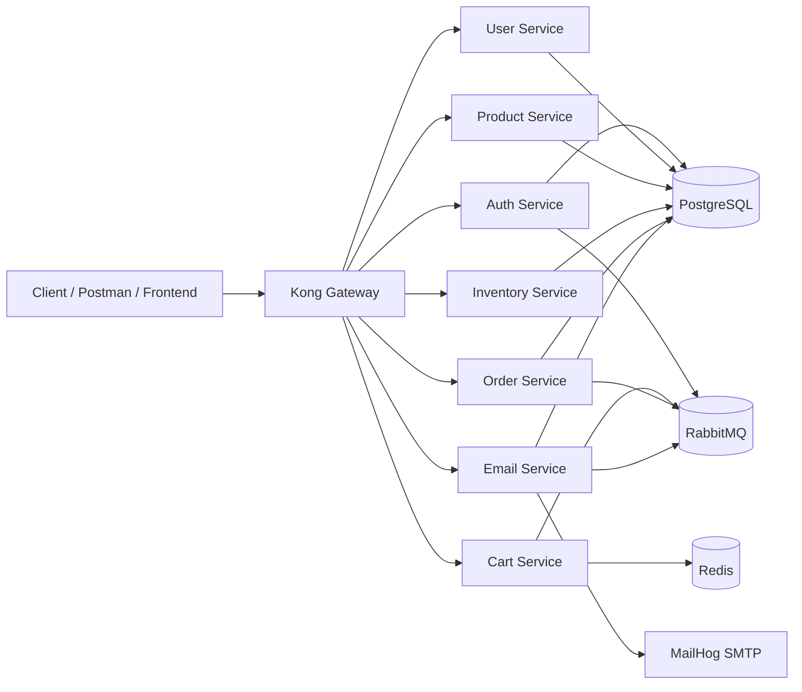
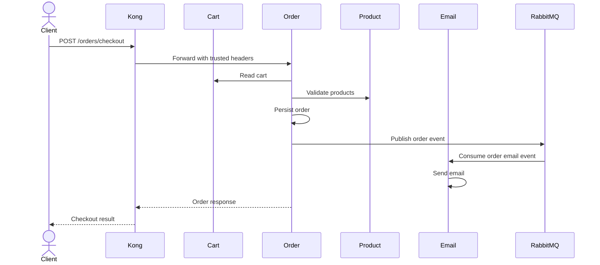

# UML

## Component Diagram

```mermaid
flowchart LR
  Client[Client / Postman / Frontend] --> Kong[Kong Gateway]

  Kong --> Auth[Auth Service]
  Kong --> User[User Service]
  Kong --> Product[Product Service]
  Kong --> Inventory[Inventory Service]
  Kong --> Cart[Cart Service]
  Kong --> Order[Order Service]
  Kong --> Email[Email Service]

  Auth --> Postgres[(PostgreSQL)]
  User --> Postgres
  Product --> Postgres
  Inventory --> Postgres
  Order --> Postgres
  Email --> Postgres

  Cart --> Redis[(Redis)]

  Auth --> RabbitMQ[(RabbitMQ)]
  Cart --> RabbitMQ
  Order --> RabbitMQ
  Email --> RabbitMQ

  Email --> MailHog[MailHog SMTP]
```

## Checkout Sequence

```mermaid
sequenceDiagram
  actor Client
  participant Kong
  participant Cart
  participant Order
  participant Product
  participant Email
  participant RabbitMQ

  Client->>Kong: POST /orders/checkout
  Kong->>Order: Forward with trusted headers
  Order->>Cart: Read cart
  Order->>Product: Validate products
  Order->>Order: Persist order
  Order->>RabbitMQ: Publish order event
  RabbitMQ->>Email: Consume order email event
  Email->>Email: Send email
  Order-->>Kong: Order response
  Kong-->>Client: Checkout result
```

